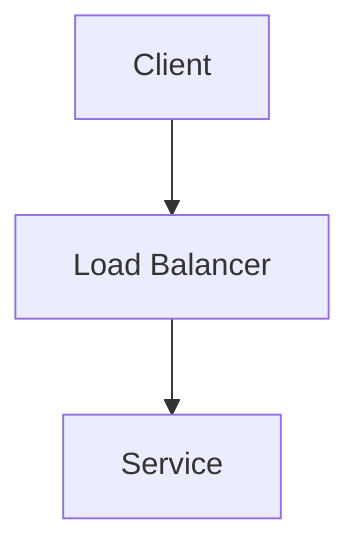

# Content

MDX content for blog posts and project case studies.

## Structure

- `blog/` - Blog posts as MDX files
- `projects/` - Project case studies with architecture diagrams

## Frontmatter Schema

### Blog Posts
```yaml
---
title: Post Title
description: Brief description for SEO
date: 2024-01-15
tags: [tag1, tag2]
published: true
---
```

### Project Case Studies
```yaml
---
title: Project Name
description: Brief description
tech: [Python, FastAPI, Kubernetes]
featured: true
---
```

## Mermaid Diagrams

Use fenced code blocks with `mermaid` language:


